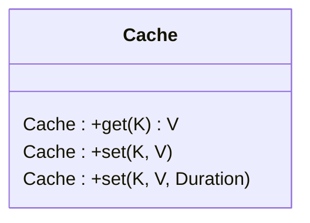

# LRU Cache
## Functional Requirement
1. Provide a way to set the size of cache
2. Provide an api to add new item in cache without expiry
3. Provide an api to add new item in cache with expiry
4. Provide an api to get new item in cache

## Non Functional Requirement
1. Adding new item should be O(1)
2. Getting new item should be O(1)
3. Able to evict least recently used item if cache is full

## UML Diagram

## Next steps
write async code to delete the expired nodes to free up space.