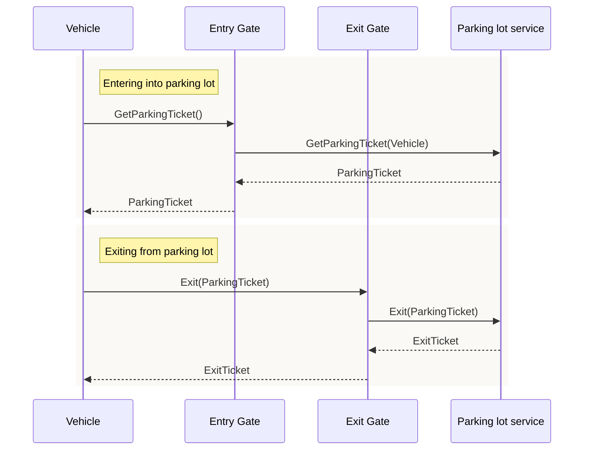

# Parking lot 
## Requirement
Parking lot is an area designated for parking cars. Parking lot has fixed
number multiple floor and each floor has fixed number of slots. Also it has multiple 
entry point and multiple exit points. At the entry point Multiple check points are installed that
disbursed ticket and at the exit customer needs to pay parking fee.

## Solution

High level call flow diagram
