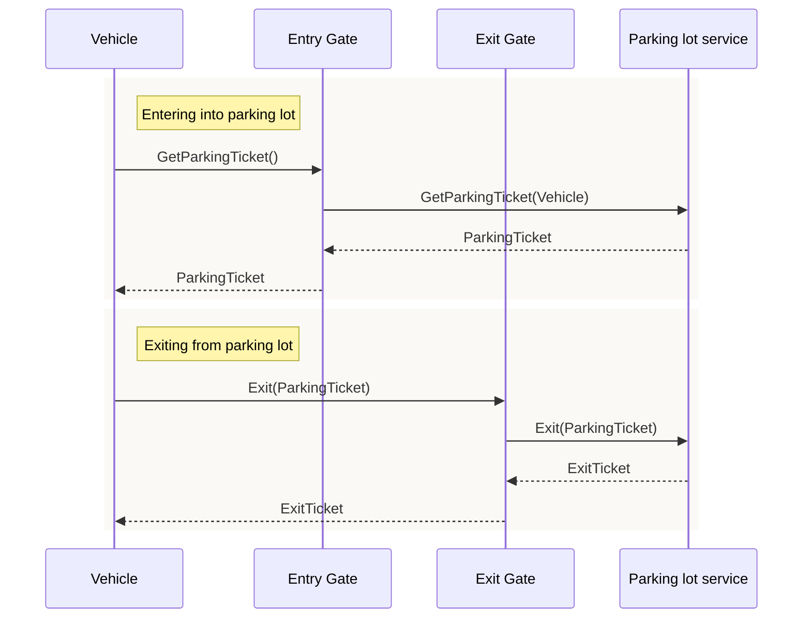
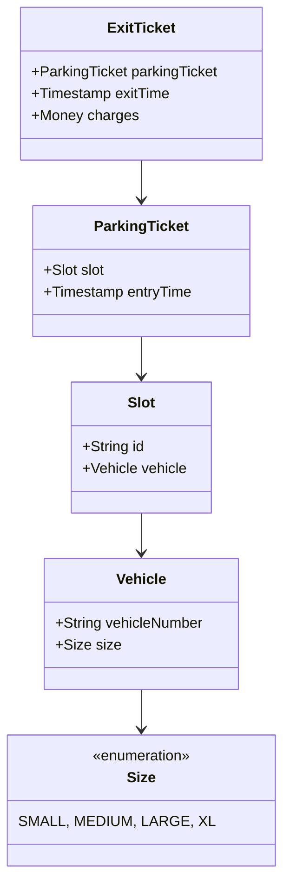

# Parking lot 
## Requirement
Parking lot is an area designated for parking cars. Parking lot has fixed
number multiple floor and each floor has fixed number of slots. Also it has multiple 
entry point and multiple exit points. At the entry point Multiple check points are installed that
disbursed ticket and at the exit customer needs to pay parking fee.

## Solution

### High level call flow diagram

### UML Diagram

### Deployment strategy
Assuming system is powering 10K parking lot and each parking lot getting 2 vehicles per minute.
QPS on GetParkingTicket API = (10K * 2)/60 ~= 300
QPS on Exit API ~= 300
Assuming average stay time is 2 hour so data needs to hold is 2*60*2*10K = 2400K ~ 1 GB
metadata storage is also 1 GB
Old data can be archived to cold data store to reduce cost.
This data can be store in the NoSQL database(DDB) as data can be partitioned based on the parking lot and tenant isolation can be achieved.
Instead of deploying it as a service it can be deployed as lambda.
